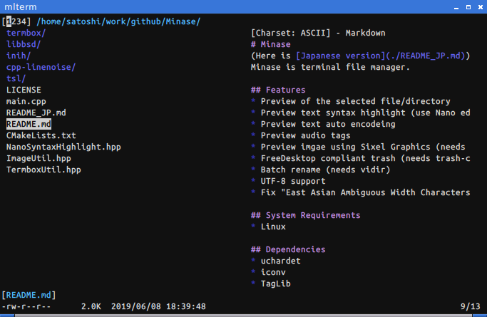
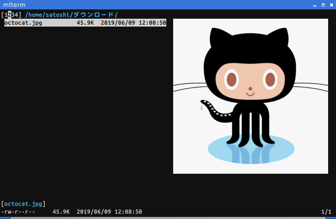

# Minase
Minaseはターミナルで動くファイラーです





## Features
* 選択しているファイル/ディレクトリのプレビュー表示
* プレビューテキストのシンタックスハイライト表示 (Nano editorのシンタックスハイライト定義ファイルを使います)
* プレビューテキストの文字コードを自動認識
* オーディオファイルのタグをプレビュー表示
* 圧縮ファイルをプレビュー表示 (lsarまたはbsdtarが必要)
* Sixel Graphicsを使ったイメージプレビュー (img2sixelが必要)
* FreeDesktopに準拠したゴミ箱 (trash-cliが必要)
* バッチリネーム (vidirが必要)
* UTF-8 に対応
* "East Asian Ambiguous Width Characters"問題を修正 (wcwidth-cjkを使います)

## System Requirements
* Linux

## Dependencies
* uchardet
* iconv
* TagLib

optional:
* libsixel
* trash-cli
* vidir
* lsar or bsdtar
* cmigemo

## Usage
|Keys|Description|
| ---- | ---- |
|h, Right| 親ディレクトリへ移動|
|j, Down| 下に移動|
|k, Up| 上に移動|
|l, Right| file/directoryを開く|
|PgUp, ^U| 上にスクロール|
|PgDn, ^D| 下にスクロール|
|H| 画面の一番上に移動|
|M| 画面の中央に移動|
|L| 画面の一番下に移動|
|g| 最初の項目に移動|
|G| 最後の項目に移動|
|^L| 再描画|
|q| 終了|
|^G| 終了した後にcd|
|0| ログを見る|
|1| タブ1 に切り替え|
|2| タブ2 に切り替え|
|3| タブ3 に切り替え|
|4| タブ4 に切り替え|
|,| ファイルリストを simple/detail 表示に切り替え|
|.| ドットファイルの表示/非表示|
|i| イメージプレビューの有効/無効|
|z| アーカイブを作成|
|Z| 現在の行を画面の中心に|
|s| ソート項目の変更|
|e| ファイルを編集|
|Space| ファイルをマーク|
|u| マークを消去|
|a| 現在のディレクトリのマークを反転|
|c| マークしたファイルにコピーマークを付ける|
|m| マークしたファイルにムーブマークを付ける|
|d| マークしたファイルを削除|
|p| コピー/ムーブマークをつけたファイルを貼り付け|
|r| 現在のファイルをリネーム|
|^R| バッチリネーム (vidir)|
|!| シェルを起動|
|n| file/directoryの作成|
|b| ブックマークを開く|
|/| フィルター|
|^/| フィルターの種類を変更|
|*| 実行属性をトグルする|
|x| アーカイブを解凍|
|^x| pluginを実行|
|Alt + key| pluginを実行|
|^j| プレビュー画面を下にスクロール|
|^k| プレビュー画面を上にスクロール|
|^a| アーカイブマウントディレクトリへ移動|
|?| ヘルプを表示|

終了時にcdするには:
```
 $ minase; if [ -f ~/.config/Minase/lastdir ]; then cd "`cat ~/.config/Minase/lastdir`"; rm ~/.config/Minase/lastdir; fi;
```
## Installation
```
$ cmake .
$ make
$ sudo make install
```

## Customization
~/.config/Minase/config.ini
```
[Options]
; File Opener
Opener = xdg-open

; Log view Max lines
LogMaxLines = 100

; Preview Max lines (-1: 無制限)
PreViewMaxLines = 50

; Use trash-cli
UseTrash = true

; Nano Editor Syntax Highlighting Files
NanorcPath = /usr/share/nano/

; East Asian Ambiguous Width
wcwidth-cjk = false

; 0: simple / 1: detail
FileViewType = 0

; 0: name / 1: size / 2: date
SortType = 2

; 0: Ascending / 1: Descending
SortOrder = 1

; Migemo Dictionary File
;MigemoDict = /usr/share/migemo/utf-8/migemo-dict

; 0: Normal / 1: Regexp / 2: Migemo
FilterType = 0
```

~/.config/Minase/bookmarks    
```
~/Download
~/Documents
/usr/local
```

~/.config/Minase/plugin.ini   
 ```
[sxiv]
; Plugin Path
filepath = ~/.config/Minase/plugins/0sxiv
; GUI: true / false
gui = true
; Shortcut Key
key = s

[autojump]
filepath = ~/.config/Minase/plugins/_1autojump%
key = j
```

## License
* MIT
